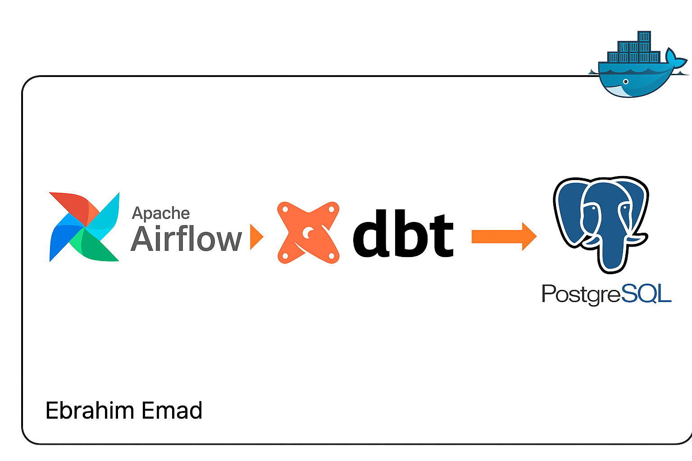
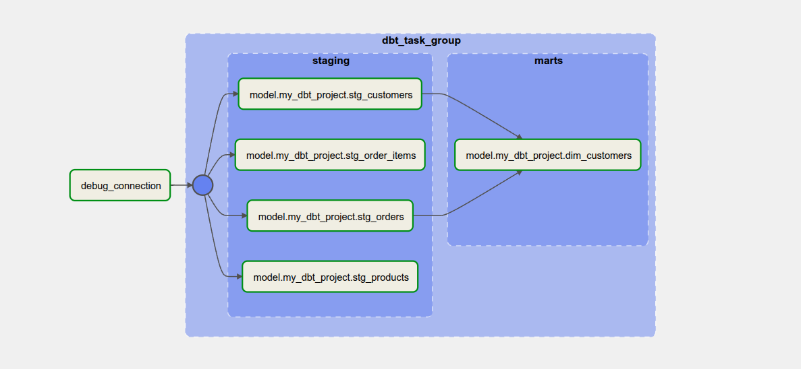

# Python + DBT + Airflow Project

A production-ready data engineering environment using Apache Airflow and dbt, containerized via Docker.

## Architecture


## Pipline


## Project Structure

```
.
├── Dockerfile               # Unified multi-stage Dockerfile (airflow, airflow_simple, dbt)
├── docker-compose.yml       # Single compose with profiles (simple/full)
├── start.bat                # Windows start script (MODE: simple|full)
├── scripts/
│   ├── Aiflow.sh   # Airflow initialization
│   └── dbt.sh      # dbt initialization
|   └──  start.sh   # start project file
├── airflow/  # Airflow DAGs
|   └── 
|      dags/                   
│      └── dbt_dag.py
├── dbt/                     # dbt project
│   ├── dbt_project.yml
│   ├── profiles/profiles.yml
│   ├── models/
│   └── tests/
|   └── target/
|   └── logs/
|
├── dbt_airflow/ # dbt package that use to branch the tasks in dbt
├── .github/workflows/  # to test building dockerfiles
├── requirements.txt         # Unified dependencies (providers, dbt, libs)
├── .gitignore
└── README.md                # This file
```

## Quick Start

### Prerequisites
- Docker Desktop running
- 8GB+ RAM available


### Start (CLI alternative)

  ```bash
  docker-compose up -d --build
  ```

### Access Services
- Airflow Web UI: http://localhost:8080 (admin/admin)
- PostgreSQL: localhost:5433 (airflow/airflow)


## Running dbt
```bash
docker-compose  exec dbt bash
cd /opt/dbt

dbt debug
dbt deps
dbt run
dbt test
dbt docs generate
```

## Development Workflow
- Add DAGs to `dags/`
- Add dbt models under `dbt/models/`
- Use `requirements.txt` to pin dependencies

## Troubleshooting
- Rebuild everything:
  ```bash
  docker-compose down -v
  docker-compose  -d --build
  ```
- Check logs:
  ```bash
  docker-compose  logs -f
  ```

